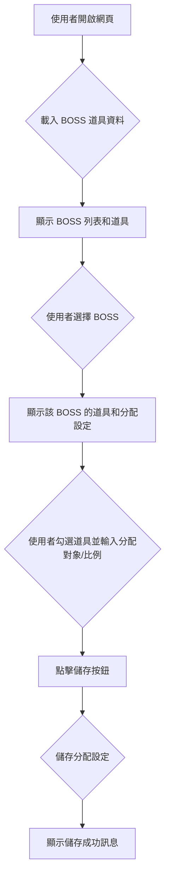

# 楓之谷 BOSS 道具分配系統規劃

## 1. 概述
本系統旨在提供一個介面，讓使用者可以查看楓之谷 BOSS 掉落的道具，並為每個 BOSS 的道具設定分配對象和分配比例。

## 2. 爬蟲部分 (已完成)
*   使用 Python 爬蟲抓取 `maplen.gg` 網站上各 BOSS 的道具名稱和圖片 URL。
*   包含 BOSS 名稱、道具名稱和圖片 URL。
*   額外添加 "neso (big)" 和 "neso (small)" 道具及其圖片 URL。
*   資料儲存為 CSV 檔案 (`boss_items.csv`)。

## 3. 分配功能規劃

### 3.1. UI 介面設計 (HTML/CSS/JavaScript)
*   **BOSS 列表顯示區塊**:
    *   顯示所有 BOSS 的名稱。
    *   每個 BOSS 旁邊有一個可展開/收合的區域，顯示該 BOSS 的道具列表。
*   **道具顯示區塊**:
    *   每個道具顯示其名稱和圖片。
    *   每個道具旁邊有一個核取方塊，用於勾選是否分配。
*   **分配對象輸入區塊**:
    *   一個輸入框，用於輸入參與分配的人員名稱，可以多個，用逗號分隔。
*   **分配比例輸入區塊**:
    *   每個參與分配的人員旁邊有一個輸入框，用於輸入其分配比例。
    *   總比例應為 100%。
*   **儲存/更新按鈕**:
    *   用於儲存分配設定。

### 3.2. 資料儲存方式
*   **BOSS 道具資料**: 繼續使用 `boss_items.csv` 儲存爬蟲抓取的資料。
*   **分配設定資料**: 考慮使用 JSON 檔案 (`allocations.json`) 來儲存每個 BOSS 的分配對象和比例。
    *   結構範例：
        ```json
        {
            "boss_name_1": {
                "participants": ["PlayerA", "PlayerB"],
                "allocations": {
                    "PlayerA": 0.5,
                    "PlayerB": 0.5
                },
                "selected_items": ["item_name_1", "item_name_2"]
            },
            "boss_name_2": {
                "participants": ["PlayerC", "PlayerD", "PlayerE"],
                "allocations": {
                    "PlayerC": 0.3,
                    "PlayerD": 0.3,
                    "PlayerE": 0.4
                },
                "selected_items": ["item_name_3"]
            }
        }
        ```

### 3.3. 功能流程



## 4. 後續步驟
1.  根據 UI 介面設計，修改 `index.html`、`style.css` 和 `script.js`。
2.  實現讀取 `boss_items.csv` 和儲存/載入 `allocations.json` 的 JavaScript 邏輯。
3.  實現分配對象和比例的動態輸入和驗證。
4.  實現道具勾選功能。
